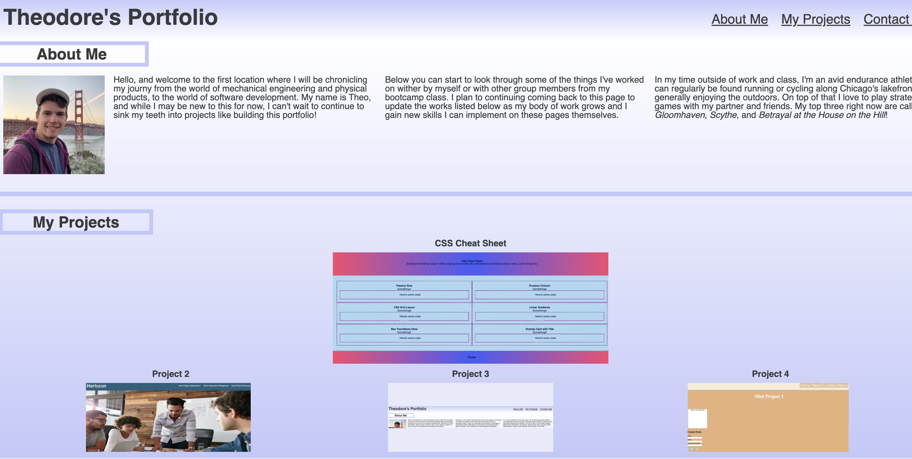

# PortfolioAssignment

## Description

The goal with this project was to create a first page of an online portfolio to contain links to deployed applications and other projects that I've worked on or built. The page itself as well as all of the formatting was done from scratch, and it has a responsive design making it easily viewable on multiple different screen sizes. 

As a result, the page should provide a great jumping off point to continue adding more projects and links as my body of work continues to go throught this class and my career.

## Usage

See the deployed application [here](https://tward9.github.io/PortfolioAssignment/)

When opened, you should see the below image:

